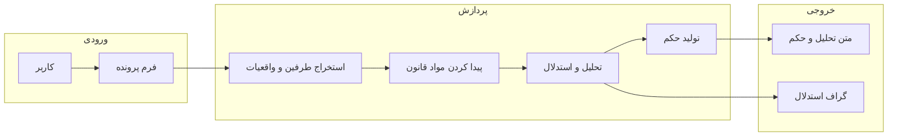

# دادیار هوشمند

**تحلیلگر هوشمند پرونده‌های غصب و خلع ید** — با استفاده از هوش مصنوعی و مواد قانون مدنی ایران.

---

## این اپ دقیقاً چیه؟

یک **برنامه وب** که به آن متن یک پرونده حقوقی (غصب یا خلع ید) را می‌دهی؛ برنامه با کمک **هوش مصنوعی**:

- مواد قانونی **مرتبط** را از قانون مدنی (مواد ۳۰۸ تا ۳۲۷) پیدا می‌کند،
- استدلال را **قدم‌به‌قدم** می‌سازد،
- یک **تحلیل حقوقی** و یک **حکم نمونه** به تو نشان می‌دهد،
- و همه این مراحل را در یک **گراف استدلال** به صورت تصویری نمایش می‌دهد.

هدف این اپ **تحقیق و آموزش** است؛ جایگزین قاضی یا مشاور حقوقی نیست.

---

## ویژگی‌های اصلی

| ویژگی | توضیح کوتاه |
|--------|----------------|
| **ورودی پرونده** | فرم برای شناسه، تاریخ، خواهان، خوانده و شرح پرونده |
| **استخراج خودکار** | تشخیص طرفین، نوع پرونده، واقعیات و ادعاها از متن |
| **RAG روی قانون** | بازیابی مواد مرتبط از قانون مدنی (۳۰۸–۳۲۷) با جستجوی معنایی |
| **تحلیل زنجیره‌ای** | استدلال گام‌به‌گام (Chain-of-Thought) برای هر ماده |
| **گراف استدلال** | نمایش تصویری: واقعیت‌ها → مواد → نتیجه‌گیری‌ها → حکم |
| **حکم نمونه** | تولید متن حکم با خلاصه، واقعیات اثبات‌شده، تحلیل و ruling |
| **دو مدل AI** | پشتیبانی از **OpenAI** (GPT) و **Google Gemini** (امکان استفاده رایگان) |

---

## اجرای سریع (Quick Start)

### پیش‌نیاز

- **پایتون ۳.۱۰** یا بالاتر ([دانلود از python.org](https://www.python.org/downloads/))
- یک **کلید API** از OpenAI یا Google AI Studio (Gemini)

### ویندوز

1. فایل **`install_and_run.bat`** را اجرا کنید (دابل‌کلیک یا از خط فرمان).
2. بار اول: پایتون محیط مجازی می‌سازد و کتابخانه‌ها را نصب می‌کند؛ بعد برنامه اجرا می‌شود و مرورگر باز می‌شود.
3. اگر فایل `.env` نبود، از روی `.env.example` ساخته می‌شود — **کلید API** را داخل `.env` قرار دهید.

### لینوکس / مک

```bash
chmod +x install_and_run.sh
./install_and_run.sh
```

همین‌طور فایل `.env` را از روی `.env.example` بسازید و کلید API را در آن تنظیم کنید.

### آدرس برنامه

بعد از اجرا، برنامه روی آدرسی مثل **http://localhost:8501** در مرورگر باز می‌شود.

---

## جریان کار به زبان ساده



کاربر در **فرم** اطلاعات پرونده را وارد می‌کند → برنامه **طرفین و واقعیات** را استخراج می‌کند → **مواد قانونی مرتبط** را پیدا می‌کند → **تحلیل و استدلال** می‌سازد → **حکم نمونه** و **گراف استدلال** را نشان می‌دهد.

---

## ساختار پروژه

```
Dadyar/
├── app.py                 # نقطه ورود رابط کاربری (Streamlit)
├── launcher.py            # اجرای سرور و باز کردن مرورگر
├── requirements.txt       # لیست کتابخانه‌های پایتون
├── install_and_run.bat    # نصب و اجرا در ویندوز
├── install_and_run.sh     # نصب و اجرا در لینوکس/مک
├── build_windows.bat      # ساخت فایل اجرایی ویندوز
├── build_linux.sh        # ساخت اجرایی لینوکس
├── dadyar.spec            # تنظیمات PyInstaller
├── .env.example           # نمونه تنظیمات (کلید API و غیره)
├── config/                # تنظیمات و متن پرامپتهای AI
├── data/                  # مواد قانونی و پرونده‌های نمونه (JSON)
├── assets/styles/         # استایل و قالب ظاهری (CSS)
├── modules/
│   ├── legal_engine/      # موتور حقوقی: AI، RAG، استدلال، حکم
│   ├── graph_builder/     # ساخت و رسم گراف استدلال
│   └── ui_components/     # قطعات رابط: فرم، سایدبار، نمایش تحلیل و گراف
└── docs/                  # مستندات تکمیلی
```

توضیح **ریز هر فایل و پوشه** در [docs/STRUCTURE.md](docs/STRUCTURE.md).

---

## تکنولوژی‌ها (Tech Stack)

| نام | نقش در پروژه |
|-----|----------------|
| **Streamlit** | فریم‌ورک وب برای ساخت رابط کاربری با پایتون |
| **OpenAI / Gemini** | مدل‌های زبانی برای تحلیل متن و تولید استدلال و حکم |
| **RAG** | بازیابی مواد مرتبط از قانون + دادن به مدل برای پاسخ دقیق‌تر |
| **TF-IDF + شباهت** | جستجوی محلی در مواد قانونی (بدون فراخوانی API برای جستجو) |
| **NetworkX** | ساخت گراف جهت‌دار (واقعیت‌ها → مواد → نتیجه → حکم) |
| **Plotly** | رسم گراف برای نمایش در مرورگر |
| **Pydantic** | تعریف شکل داده و تنظیمات و اعتبارسنجی |
| **Hazm / jdatetime** | نرمال‌سازی متن و تاریخ شمسی فارسی |

اصطلاحات بیشتر در [docs/GLOSSARY.md](docs/GLOSSARY.md).

---

## پیکربندی

فایل **`.env`** (از روی `.env.example` کپی کنید) شامل:

- **AI_PROVIDER**: `openai` یا `gemini`
- **OPENAI_API_KEY** یا **GEMINI_API_KEY**: کلید API مربوطه
- **OPENAI_MODEL** / **GEMINI_MODEL**: نام مدل (مثلاً `gpt-4-turbo-preview` یا `gemini-2.0-flash`)
- تنظیمات دیگر مثل تعداد مواد بازیابی‌شده، آستانه شباهت، رنگ گراف و غیره

همه مقادیر را می‌توان در سایدبار برنامه هم در حین اجرا عوض کرد.

---

## ساخت نسخه توزیعی (exe / اجرایی)

- **ویندوز**: بعد از نصب وابستگی‌ها، اسکریپت **`build_windows.bat`** را اجرا کنید. خروجی در `dist\dadyar\` قرار می‌گیرد.
- **لینوکس**: اسکریپت **`build_linux.sh`** را اجرا کنید. خروجی در `dist/dadyar/` است.

برای توزیع، کل پوشه `dist/dadyar` را (شامل exe و فایل‌های وابسته) به کاربر بدهید.

---

## نسخه و نویسنده

- **نسخه**: ۱.۲.۰  
- **توسعه‌دهنده**: مهسا میرزایی  
- **زمینه**: پروژه پایان‌نامه — شبیه‌سازی تصمیم‌گیری قضایی با هوش مصنوعی

---

## مستندات بیشتر

| سند | محتوا |
|-----|--------|
| [docs/STRUCTURE.md](docs/STRUCTURE.md) | ریز هر فایل و پوشه و وظیفه آن |
| [docs/ARCHITECTURE.md](docs/ARCHITECTURE.md) | معماری، جریان داده، استانداردها |
| [docs/GLOSSARY.md](docs/GLOSSARY.md) | واژه‌نامه اصطلاحات به زبان ساده |

اگر اصطلاحی مثل RAG، LLM یا Embedding برات مبهم است، از **واژه‌نامه** شروع کن.
