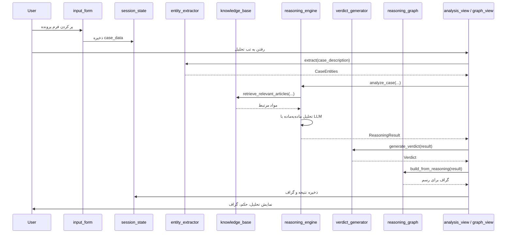

# معماری و استانداردهای پروژه دادیار

این سند هدف پروژه، لایه‌های معماری، جریان داده و استانداردهای کدنویسی را توضیح می‌دهد.

---

## هدف پروژه

- **شبیه‌سازی تصمیم‌گیری قضایی** با کمک هوش مصنوعی برای **آموزش و تحقیق**.
- تمرکز روی **غصب** و **خلع ید** و مواد **۳۰۸ تا ۳۲۷** قانون مدنی ایران.
- برنامه **جایگزین قاضی یا مشاور حقوقی نیست**؛ خروجی «تحلیل و حکم نمونه» صرفاً برای درک فرآیند استدلال و آزمایش مدل‌ها است.

---

## معماری کلی (لایه‌ها)

```
┌─────────────────────────────────────────────────────────────┐
│  لایه رابط کاربری (UI)                                      │
│  Streamlit — تب‌ها، فرم، سایدبار، نمایش تحلیل و گراف         │
│  app.py + modules/ui_components/*                            │
└─────────────────────────────────────────────────────────────┘
                              │
                              ▼
┌─────────────────────────────────────────────────────────────┐
│  لایه منطق (Business Logic)                                 │
│  legal_engine: استخراج موجودیت، RAG، استدلال، حکم           │
│  graph_builder: ساخت گراف + رندر با Plotly                   │
│  modules/legal_engine/* , modules/graph_builder/*            │
└─────────────────────────────────────────────────────────────┘
                              │
                              ▼
┌─────────────────────────────────────────────────────────────┐
│  لایه پیکربندی و داده                                        │
│  config: تنظیمات (settings) و پرامپتها (prompts)             │
│  data: مواد قانونی و پرونده‌های نمونه (JSON)                 │
└─────────────────────────────────────────────────────────────┘
```

- **UI**: فقط نمایش و ورودی کاربر؛ هیچ منطق حقوقی در UI نیست.
- **منطق**: تمام استدلال و تولید متن در `legal_engine` و ساخت/رسم گراف در `graph_builder`.
- **پیکربندی و داده**: جدا از کد؛ تغییر مدل یا متن پرامپت بدون تغییر منطق اصلی ممکن است.

---

## جریان داده (Data Flow)



- کاربر در **فرم** اطلاعات پرونده را وارد می‌کند → در **session** به صورت `case_data` ذخیره می‌شود.
- در تب تحلیل: **EntityExtractor** طرفین و واقعیات را استخراج می‌کند → **KnowledgeBase** مواد مرتبط را برمی‌گرداند → **ReasoningEngine** با مدل تحلیل می‌کند و **ReasoningResult** می‌سازد → **VerdictGenerator** حکم نهایی را تولید می‌کند → **ReasoningGraph** گراف را می‌سازد و در UI با **Plotly** رسم می‌شود.
- نتیجه و گراف در **session** کش می‌شوند تا با هر بار رفرش تب دوباره API صدا زده نشود.

---

## الگوهای طراحی استفاده‌شده

| الگو | کجا | هدف |
|------|-----|-----|
| **Singleton** | `get_settings()`, `get_knowledge_base()`, `get_persian_utils()`, و در صورت وجود instanceهای entity/reasoning/verdict | یک نمونه واحد در کل برنامه؛ جلوگیری از ساخت مکرر و ناهماهنگی. |
| **Factory** | `client_factory.get_llm_client()` | انتخاب و ساخت کلاینت مناسب (OpenAI یا Gemini) بر اساس تنظیمات یا انتخاب کاربر. |
| **کش (Cache)** | `base_client` برای پاسخ‌های LLM؛ `st.session_state` برای نتیجه تحلیل و گراف | کاهش فراخوانی تکراری به API و محاسبه دوباره. |
| **تنظیمات متمرکز** | `config/settings.py` + `.env` | یک نقطه واحد برای همه تنظیمات؛ تغییر بدون جستجو در کل کد. |
| **پرامپتهای جدا** | `config/prompts.py` | متن‌های ارسال‌شده به مدل در یک فایل؛ قابل ویرایش و نسخه‌گذاری بدون دست زدن به منطق. |

---

## استانداردهای کدنویسی

- **نوع‌گذاری و اعتبارسنجی**: استفاده از **Pydantic** برای تنظیمات (`Settings`) و ساختار خروجی‌ها (مثل `CaseEntities`, `Verdict`).
- **مسیر فایل‌ها**: استفاده از **pathlib.Path** و مسیر نسبی نسبت به ریشه پروژه تا در محیط‌های مختلف و در بسته PyInstaller درست کار کند.
- **تنظیمات**: خواندن از **متغیرهای محیطی** و فایل **`.env`**؛ عدم hardcode کردن کلید API یا مقادیر حساس.
- **زبان و جهت**: پشتیبانی **راست‌به‌چپ (RTL)** و **فارسی** در UI و پرامپتها؛ استفاده از `persian_utils` برای تاریخ و اعداد.
- **جداسازی نقش‌ها**: UI فقط نمایش و جمع‌آوری ورودی؛ منطق حقوقی و گراف در ماژول‌های جدا.

---

## امنیت و حریم خصوصی

- **کلید API** فقط در فایل **`.env`** قرار می‌گیرد و این فایل در **`.gitignore`** است تا داخل مخزن نسخه‌گذاری نرود.
- پرونده‌های واردشده توسط کاربر فقط در **حافظه جلسه (session)** نگه داشته می‌شوند و روی سرور یا دیسک ذخیره نمی‌شوند (مگر در صورت وجود قابلیت صریح export که در مستندات جداگانه ذکر می‌شود).
- ارتباط با APIهای خارجی (OpenAI/Gemini) بر اساس اسناد رسمی آن‌ها است؛ داده فقط برای تولید پاسخ به سرویس ارسال می‌شود.

---

برای دیدن **وظیفه هر فایل** به [STRUCTURE.md](STRUCTURE.md) و برای **معنی اصطلاحات** به [GLOSSARY.md](GLOSSARY.md) مراجعه کن.
